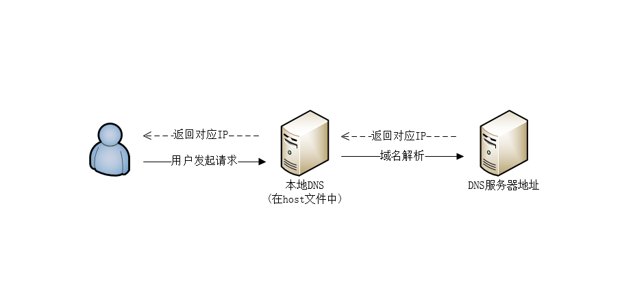

#### 从打开一个网址说起

当在浏览器中输入一个网址的时候，浏览器会渲染出对应的网页的内容。作为web开发人员来说，应该知道这个过程：

1. 当输入的一个网址为域名的时候，浏览器则根据本机的网关和DNS服务器来解析出访问的真正的IP地址。如果是直接访问IP则直接与服务器通信，发送请求。 请求原理简单如下：

   
   \(此处只是简单表示下域名解析原理，解析过程比这个复杂的多。\)

2. 发送请求的时候会经历TCP三次握手过程（http也是基于TCP的协议），当TCP连接建立成功后，浏览器会根据http协议，把请求的内容封装成请求报文，发送给web服务器.

3. 服务器会根据请求的报文的内容，执行对应的程序和读取对应的文件，按照http协议的规则返回响应内容\(包括header和body\)。

4. 服务器根据响应头来解析响应的内容，完成html+css+js的渲染和执行。

#### http协议

> HTTP协议是Hyper Text Transfer Protocol（超文本传输协议）的缩写,是用于从万维网（WWW:World Wide Web ）服务器传输超文本到本地浏览器的传送协议。

用简单的话来说，当客户端与服务器端通信的时候，需要传输的内容有（HTML 文件,js+css, 图片,文本, 查询结果等）,http协议把内容传输规范化。可以随便查看下一个http协议的内容：


（上面的图是请求jqury的请求和响应信息）

##### 请求的头信息

```json
  GET /script/jquery.js HTTP/1.1
  Host: common.cnblogs.com
  Connection: keep-alive
  Pragma: no-cache
  Cache-Control: no-cache
  User-Agent: Mozilla/5.0 (Windows NT 6.1; WOW64) AppleWebKit/537.36 (KHTML, like Gecko) Chrome/56.0.2924.87 Safari/537.36
  Accept: */*
  Referer: http://kb.cnblogs.com/page/130970/
  Accept-Encoding: gzip, deflate, sdch
  Accept-Language: zh-CN,zh;q=0.8,en;q=0.6
  Cookie: __gads=ID=e2f30d616c5344bf:T=1484287454:S=ALNI_MY6vTrW8EvdzER-v1nE-YnGJjxTzA; pgv_pvi=1271870464; __utma=226521935.1402060598.1484617348.1487768840.1487819679.5; __utmz=226521935.1487819679.5.3.utmcsr=bing|utmccn=(organic)|utmcmd=organic|utmctr=c%23%20Semaphore; _ga=GA1.2.1402060598.1484617348
```

上面有几个重点的信息:

* **GET /script/jquery.js HTTP/1.1** 这个代表请求的方法是GET\(常用的有GET,POST,PUT,DELETE\),请求的URI为 /script/jquery.js, HTTP的版本信息为1.1

* **Accept-Encoding:**  是浏览器发给服务器,声明浏览器支持的编码类型

* **Referer:** 告诉服务器我是从哪个页面链接过来的

* **User-Agent:** 当前设备的一些信息

* **Cookie:** 客户端存储的信息，一般是登录信息或者其它认证信息

##### 响应头信息

```json
 HTTP/1.1 200 OK
 Server: Tengine
 Content-Type: application/javascript
 Content-Length: 33411
 Connection: keep-alive
 Date: Wed, 20 Jul 2016 02:26:20 GMT
 Vary: Accept-Encoding
 Cache-Control: public,max-age=25920000
 Last-Modified: Fri, 15 Feb 2013 03:06:57 GMT
 Content-Encoding: gzip
 Via: cache14.l2cm12[0,200-0,H], cache10.l2cm12[1,0], kunlun5.cn199[0,200-0,H], kunlun9.cn199[0,0]
 Age: 19461677
 X-Cache: HIT TCP_MEM_HIT dirn:9:763113955
 X-Swift-SaveTime: Fri, 26 Aug 2016 05:18:04 GMT
 X-Swift-CacheTime: 22712896
 Timing-Allow-Origin: *
 EagleId: 3d9a7e0914884432578382004e
```

* **HTTP/1.1 200 OK:** 这上代表响应http版本和响应状态

* **Server:** 代表响应的服务器的类型，此处为Tengine

* **Content-Type:**响应的类型，此处是 application/javascript，即是js文件

* **Content-Length:** 代表响应的字节数

* **Content-Encoding:**内容的编码方式，此处为gzip

**HTTP三点注意事项：**

* HTTP是无连接：无连接的含义是限制每次连接只处理一个请求。服务器处理完客户的请求，并收到客户的应答后，即断开连接。采用这种方式可以节省传输时间。

* HTTP是媒体独立的：这意味着，只要客户端和服务器知道如何处理的数据内容，任何类型的数据都可以通过HTTP发送。客户端以及服务器指定使用适合的MIME-type内容类型。

* HTTP是无状态：HTTP协议是无状态协议。无状态是指协议对于事务处理没有记忆能力。缺少状态意味着如果后续处理需要前面的信息，则它必须重传，这样可能导致每次连接传送的数据量增大。另一方面，在服务器不需要先前信息时它的应答就较快。

#### 浏览器

##### 什么是浏览器

看到http协议都是由Chrome浏览器生成和发送的，这里可以把浏览器简单的定义：

> 浏览器是一个客户端程序，能够发送http协议、解析http响应、渲染html+css+js

##### 捕获浏览器Http协议

浏览器与服务器的通信是基于TCP，发送是请求相关的内容，服务端收到请求会进行解析。基于这个原理，可以用一个用程序监听一个端口，用浏览器访问这个端口（发送数据），来捕获请求的内容。搭建一个winform窗体如下：


当点击开启的时候，运行如下代码：

```C\#
      var socket = new Socket(AddressFamily.InterNetwork, SocketType.Stream, ProtocolType.Tcp);
      var endPoint = new IPEndPoint(IPAddress.Parse(this.txtIP.Text), int.Parse(txtPort.Text));
      socket.Bind(endPoint);
      socket.Listen(10);
      if (isAutoOpen.Checked)
      {
         //使用默认的浏览器打开
          System.Diagnostics.Process.Start("http://" + this.txtIP.Text + ":" + this.txtPort.Text);
      }
      ThreadPool.QueueUserWorkItem(r =>
      {
          while (true)
          {
              var socketProx = socket.Accept(); //接收数据
              var bytes = new byte[1024 * 1024];
              var len = socketProx.Receive(bytes, 0, bytes.Length, SocketFlags.None);//获得长度
              var httpHeader = Encoding.Default.GetString(bytes, 0, len);//把二进制的数据转成文本
              SetText(httpHeader);//内容的显示
          }

      });
```

运行程序，会自动打开默认的浏览器，获得当前的ip和随机生成的接口，运行的结果如下：


监控获得内容如下：

```json
    GET / HTTP/1.1
    Host: 10.28.11.43:55882
    Connection: keep-alive
    Upgrade-Insecure-Requests: 1
    User-Agent: Mozilla/5.0 (Windows NT 6.1; WOW64) AppleWebKit/537.36 (KHTML, like Gecko) Chrome/56.0.2924.87 Safari/537.36
    Accept: text/html,application/xhtml+xml,application/xml;q=0.9,image/webp,*/*;q=0.8
    Accept-Encoding: gzip, deflate, sdch
    Accept-Language: zh-CN,zh;q=0.8,en;q=0.6 
```

捕获的http的信息，与上面谈到的信息格式是相同的。

##### 响应请求的内容

当请求过来的时候，基于上面的代码，可以给浏览器发送一个信息，在while块里面添加代码：

```C\#
   while (true)
   {
       var socketProx = socket.Accept(); //接收数据
       var bytes = new byte[1024 * 1024];
       var len = socketProx.Receive(bytes, 0, bytes.Length, SocketFlags.None);
       var httpHeader = Encoding.Default.GetString(bytes, 0, len);
       SetText(httpHeader);

       if (!string.IsNullOrEmpty(httpHeader))
       {
           var httpResponse = "<h1>Hello Http</h1>";
           var sentBytes = Encoding.Default.GetBytes(httpResponse);
           socketProx.Send(sentBytes, 0, sentBytes.Length, SocketFlags.None);
           socketProx.Shutdown(SocketShutdown.Both);
       }

   }
```

用Chrome请求结果为：  


用火狐请求的结果为：


在面对上面的两个浏览器的请求结果时候，可以看到，此时程序已经和浏览器进行了通信。造成上面的两个结果的不同，是没有指定响应的内容，浏览器按照默认的格式进行渲染，所以Chrome认为是html，而FireFox认为是text。

避免上面的结果，可以响应的时候把返回的内容进行约束，即：Content-Type属性。把响应的内容修改如下：

```C#
    var httpResponse = "<h1>Hello Http</h1>";
    var sentBytes = Encoding.Default.GetBytes(httpResponse);

    var sb = new StringBuilder();
    sb.AppendLine("HTTP/1.1 200 OK");
    sb.AppendLine("Date:" + DateTime.Now);
    sb.AppendLine("Content-Type:text/html");
    sb.AppendLine("Content-Length:" + sentBytes.Length);
    sb.AppendLine();
    var sentHeader = Encoding.Default.GetBytes(sb.ToString());
    socketProx.Send(sentHeader, 0, sentHeader.Length, SocketFlags.None);//发送内容前，先发送响应的头文件 

    socketProx.Send(sentBytes, 0, sentBytes.Length, SocketFlags.None);
    socketProx.Shutdown(SocketShutdown.Both); 
```

修改后，fireFox响应结果如下：


#### 简单的示例 --- 简单文件服务器

利用上面所述的demo，可以简单的扩展成一个简单的文件服务器。当程序启动的时候，读取当前的目录所有的文件信息转成html信息,发送给浏览器。运行结果如下 ：


这样可以简单做一个服务器，使用ajax和文件分享都是可以的。git地址：https://github.com/fuwei199006/DemoLib/tree/master/Http%E5%8D%8F%E8%AE%AE/Tools.Server  


写于 2017.03.02 


